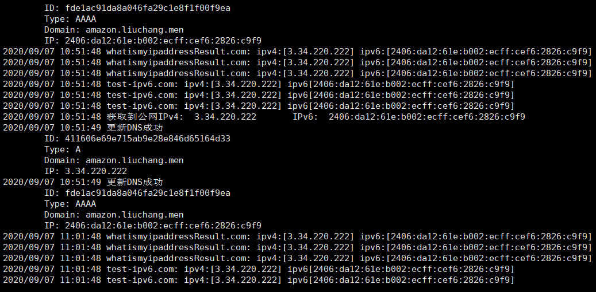
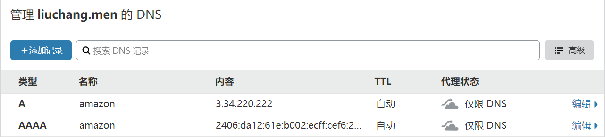

# CloudflareDDNS
`CloudflareDDNS` 是为域名托管在Cloudflare上的用户，提供动态DNS解析（又称DDNS）的工具。

### 特点：
1. 由`go`编写，可运行在多种系统平台上，未使用第三方库；
2. 支持ipv4的`A`解析，和ipv6的`AAAA`解析；
3. 获取公网IP借助[test-ipv6.com](test-ipv6.com)和[whatismyipaddress.com](whatismyipaddress.com)双平台，保证IP准确；
4. 自带周期计时器，定时更新`ipv4`和`ipv6`解析服务。

### 使用：
1. 同目录下创建`CloudflareConf.json`文件，格式如下，填写cloudflare的相关密钥
```json5
{
  "Email": "填登陆邮箱",
  "API_key": "填对应的API_key", //见 https://dash.cloudflare.com/profile/api-tokens
  "Zone_ID": "填Zone_ID值"
}
```
2. 修改`domains.json`文件，填写所需要绑定的域名
```json5
{
  "Update_IPv6": true, //当为ture时，将会添加或更行ipv6的DNS记录
  "IPv6_domain": "smile-Laptop.liuchang.men", // ipv6绑定域名
  "Update_IPv4": false, //当为ture时，将会添加或更行ipv4的DNS记录
  "IPv4_domain": "test.liuchang.men" // ipv4绑定域名
}
```
3. 编译并运行`CloudflareDDNS`，程序自动每**10分钟**（其他定时请修改代码）更新一次记录，不会因为网络原因异常退出。

### 截图：




### 注意：
* 请保证`CloudflareConf.json`和`domains.json`格式正确
* 请确保`json`文件与可执行文件在同一目录
* 其他需求请提issues或者联系邮箱*smile@liuchang.men*